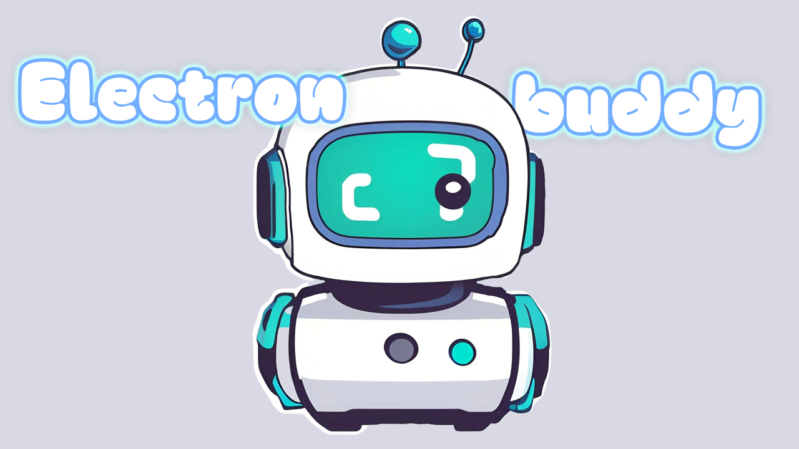

  

  <h1>@electron-buddy</h1>

    A collection of tools to help you build Electron apps.

## [Full-example](https://github.com/livemehere/electron-buddy/tree/master/packages/playground)

## Packages

| Package                                                                                                      | Version                                                                                                                       | Description |
|--------------------------------------------------------------------------------------------------------------|-------------------------------------------------------------------------------------------------------------------------------| -- |
| [@electron-buddy/vite-plugin](https://github.com/livemehere/electron-buddy/tree/master/packages/vite-plugin) |  | Vite plugin for Electron |
| [@electron-buddy/ipc](https://github.com/livemehere/electron-buddy/tree/master/packages/ipc)                 |                  | Type safe IPC helper for Electron apps |

